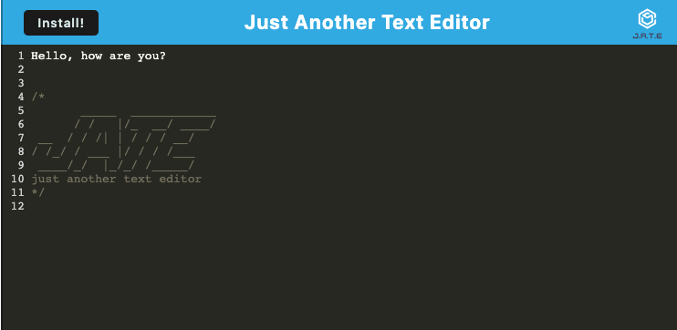
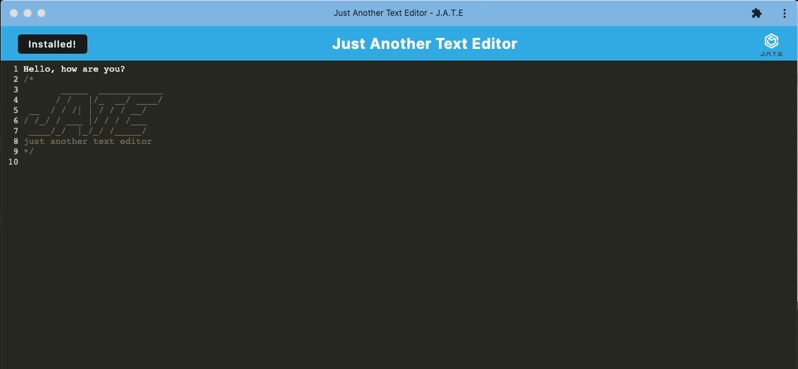

# Text-Editor-PWA

  

  ## Description
  
  The purpose of this project was to take an existing online application and transform it into a PWA so that it could not only function offline in the browser, but also be able to be installed by the user as a standalone application.
  
  ## Author
  
  The author for this project is [Mike Johnson](https://github.com/mikewebprint)
  
  ## Table of Contents
  
  - [Installation](#installation)
  - [Usage](#usage)
  - [Credits](#credits)
  - [License](#license)
  - [How to Contribute](#contributions)

  
  ## Installation
  
  This project can be used online at [https://mwp-just-another-text-editor.herokuapp.com/](https://mwp-just-another-text-editor.herokuapp.com/).  From that link, the user can also click the install button to download the application on their local computer.
  ### In browser:

 ### Installed locally:

  
  ## Credits
  
  This project did have starter code, as the text editor was existing. I modeled the PWA functionality on similar code in class projects.  I do wish to thank my instructor Kris Renaldi and the tutoring staff for assistance in troubleshooting the service worker implementation and deployment to Heroku, where this app is hosted.
  
  ## License
  
  MIT
  
  ## Features
  
  In addition to the basic functionality of a text editor, this app uses IndexedDB to hold data, with local storage as a fallback. It incorporates the use of Webpack as a build process, and is setup with an Express server on the back end.
  
  ## Contributions
  
  Contributions to the project can be offered at the repository here: [https://github.com/mikewebprint/text-editor-pwa](https://github.com/mikewebprint/text-editor-pwa)
  

  
  

